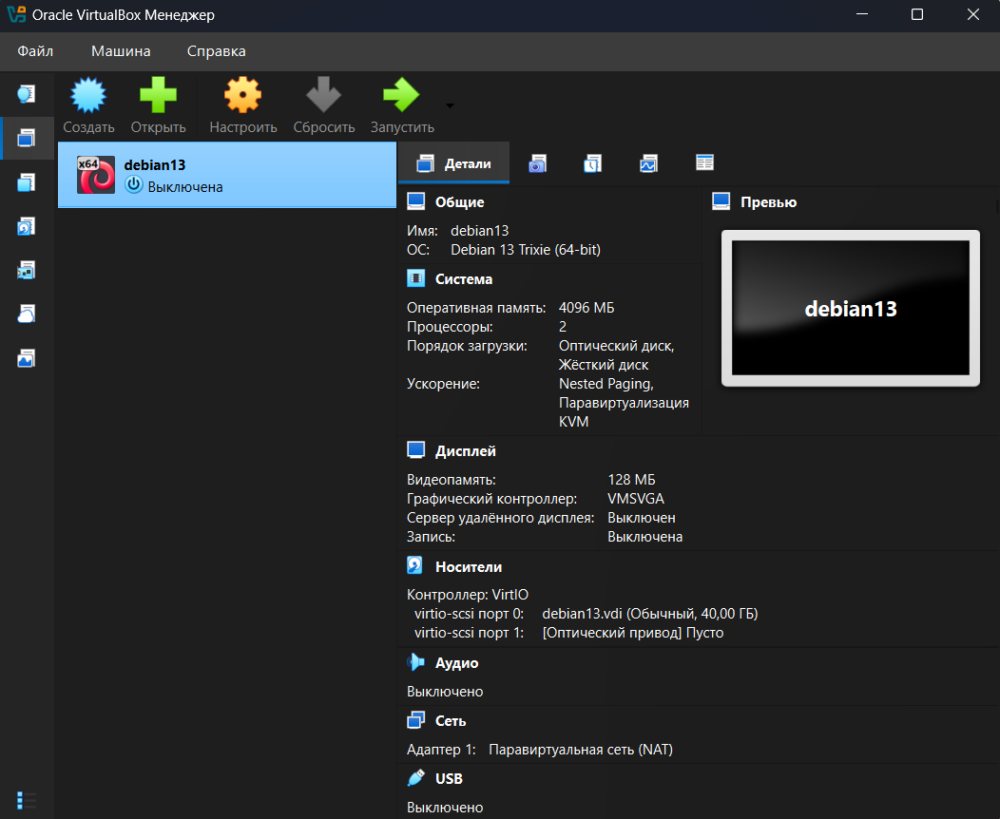
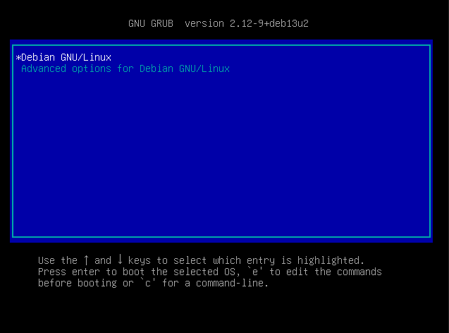
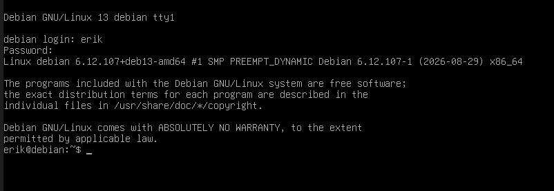
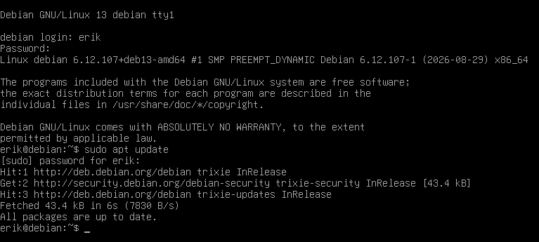
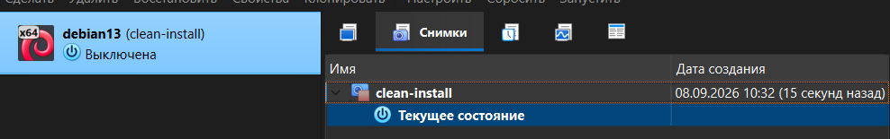

# ПРАКТИЧЕСКАЯ РАБОТА № 2

Установка Debian 13 на VirtualBox

[Инструкция для воспроизведения результата](reproducibility.md)

## Результат работы

* VirtualBox показывает VM в состоянии Powered Off

* Ubuntu загружается с виртуального диска без ISO

* Виден рабочий стол и имя пользователя

* sudo apt update завершился без ошибки сети

* В дереве снимков есть clean-install

