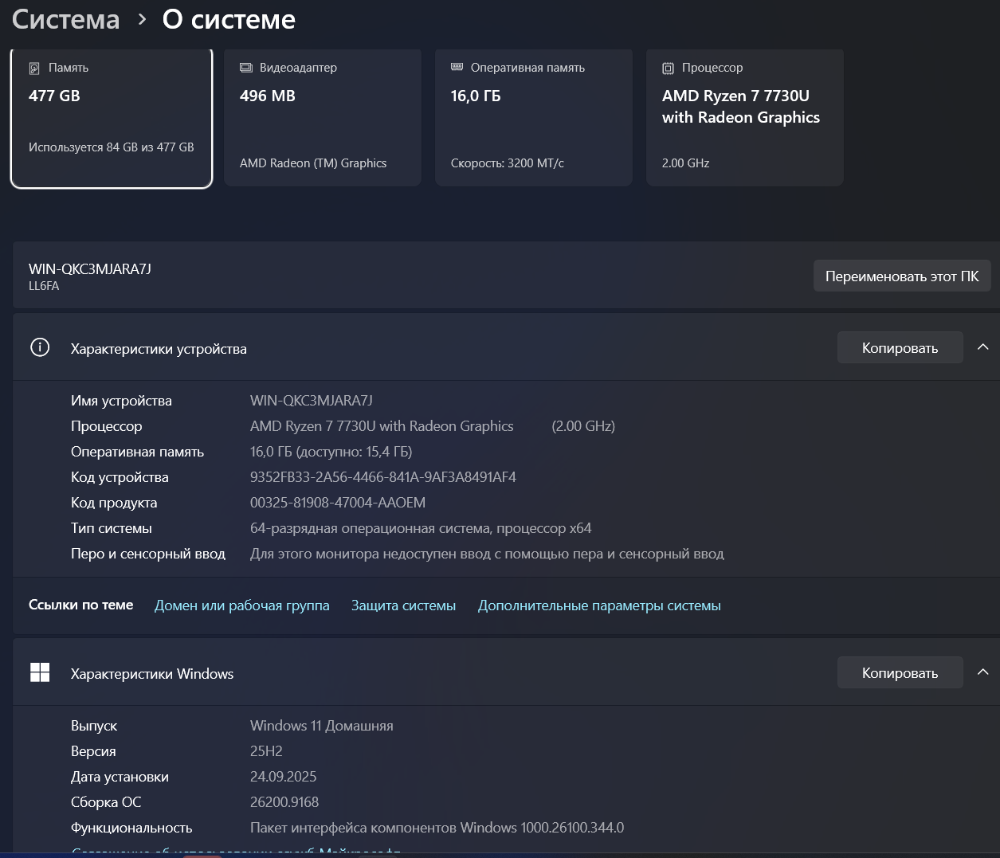
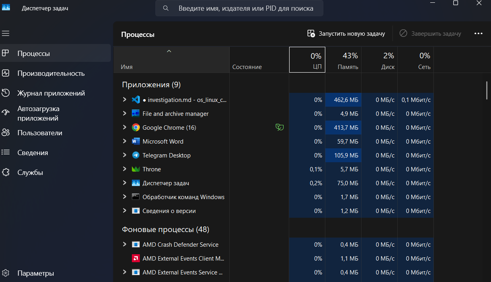
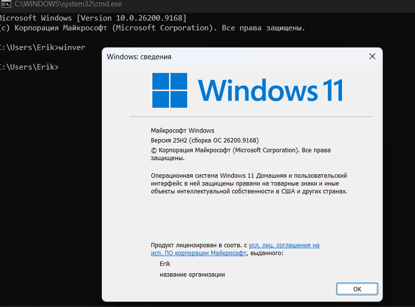

# Типы операционных систем

## 1. Краткая теория

**Операционная система (ОС)** — комплекс программ, управляющих аппаратными ресурсами компьютера (процессор, память, устройства ввода-вывода) и предоставляющих пользователю и приложениям интерфейс для работы с ними.

ОС принято классифицировать по нескольким независимым признакам:

| Признак | Возможные значения |
|---|---|
| Назначение | настольная, серверная, мобильная, встроенная, реального времени |
| Число одновременно выполняемых задач | однозадачная / многозадачная |
| Работа с пользователями | однопользовательская / многопользовательская |
| Тип интерфейса | графический (GUI), командный (CLI), комбинированный |
| Сфера применения | общего назначения / специализированная |
| Поддержка сети | локальная работа / сетевые возможности |

Эти признаки не исключают друг друга — конкретная ОС описывается сразу по всем шести, и получившийся набор характеристик и есть её классификация.

---

## 2. Классификация Windows 11 Home (мой ноутбук)

### Назначение
**Тип → настольная (десктопная) ОС**
**Почему →** Windows 11 Home разрабатывалась для персональных компьютеров и ноутбуков: ориентирована на работу одного человека за экраном, оптимизирована под клавиатуру, мышь/тачпад и монитор, а не под серверную нагрузку или встраиваемое оборудование.
**Наблюдение на ПК →** В разделе Параметры → Система → О системе указано Windows 11 Home; система работает на обычном ноутбуке, с рабочим столом, окнами и пользовательскими приложениями.

### Число задач
**Тип → многозадачная**
**Почему →** ОС умеет одновременно выполнять множество процессов, распределяя между ними процессорное время (вытесняющая многозадачность).
**Наблюдение на ПК →** в «Диспетчере задач» одновременно видно десятки запущенных процессов (браузер, среда разработки, редактор word, фоновые приложения), а пользователь может параллельно слушать музыку, печатать документ и скачивать файл.

### Работа с пользователями
**Тип → многопользовательская (по возможностям ОС), но обычно используется в однопользовательском режиме**
**Почему →** Windows 11 Home поддерживает создание нескольких учётных записей на одном устройстве с разделением файлов, настроек и прав, хотя не рассчитана на десятки одновременных сетевых сессий, как серверные редакции.
**Наблюдение на ПК →** Даже если фактически ноутбуком пользуется один человек при входе все равно указывается имя пользователя и нужно подтвердить кодом пин кода или отпечатком пальца.

### Интерфейс
**Тип → комбинированный (в первую очередь графический)**
**Почему →** основной способ взаимодействия — GUI (рабочий стол, окна, меню «Пуск»), но параллельно доступна командная строка (cmd) и PowerShell для управления системой текстовыми командами.
**Наблюдение на ПК →** повседневная работа идёт через окна и значки, но можно открыть «cmd» и выполнить команды (например, `winver`) — оба режима работают одновременно.

### Сфера применения
**Тип → общего назначения**
**Почему →** система не заточена под одну узкую задачу, а поддерживает офисные приложения, браузеры, игры, разработку, мультимедиа и т.д.
**Наблюдение на ПК →** на одном и том же ноутбуке одновременно установлены и используются совершенно разные по назначению программы: браузер, офис, мессенджеры, среды разработки.

### Поддержка сети
**Тип → полноценные сетевые возможности**
**Почему →** ОС имеет встроенный сетевой стек, поддерживает Wi-Fi, Ethernet, VPN, общий доступ к файлам и работу в интернете.
**Наблюдение на ПК →** ноутбук подключён к Wi-Fi, в трее отображается индикатор сети, работают браузер и облачные сервисы — всё это требует активной сетевой подсистемы.

---

## 3. Сравнение операционных систем

| ОС | Где применяется | Тип по назначению | Многозадачность | Интерфейс | Ключевое отличие |
|---|---|---|---|---|---|
| **Windows 11 Home** | Персональные компьютеры, ноутбуки | Настольная | Многозадачная | Комбинированный (GUI + CLI) | Ориентирована на удобство и универсальность для домашнего/офисного пользователя |
| **Manjaro** (Linux) | Настольные ПК, ноутбуки (в т.ч. для разработчиков и энтузиастов) | Настольная | Многозадачная | Комбинированный (GUI + CLI), с сильным акцентом на терминал | Полностью открытый исходный код, высокая гибкость настройки и управления пакетами |
| **Android** | Смартфоны, планшеты | Мобильная | Многозадачная | Графический (сенсорный) | Оптимизирована под сенсорный ввод, автономную работу от батареи и мобильные сети |
| **µC/OS (uC/OS)** | Встроенные устройства, промышленное оборудование, робототехника | Реального времени (встроенная) | Многозадачная (с детерминированным планировщиком) | Как правило без GUI (командный или отсутствует) | Гарантирует выполнение задач в строго заданные временные рамки (детерминизм), а не просто «быстро» |

---

## 4. Почему нельзя считать, что все ОС предназначены для одних и тех же задач

Операционные системы проектируются под конкретные условия эксплуатации и ограничения оборудования, поэтому их цели принципиально различаются.

Настольная Windows 11 Home нацелена на удобство и универсальность работы одного человека с множеством приложений, а мобильная Android — на энергоэффективность и сенсорное взаимодействие в условиях ограниченной автономности устройства. 

Серверные и сетевые сценарии требуют устойчивости к нагрузке и многопользовательского доступа, чего десктопные редакции обычно не обеспечивают в полной мере.

 Операционная система реального времени, такая как µC/OS, вообще не ориентирована на «удобство пользователя» — её главная задача — гарантированное время реакции на события, что критично для управления оборудованием, но избыточно и не нужно для домашнего ПК.
 
 Таким образом, каждая ОС — это компромисс между быстродействием, предсказуемостью, удобством интерфейса и поддерживаемым оборудованием, подобранный под конкретный класс задач. Именно поэтому невозможно выбрать одну «универсальную» ОС для всех устройств — от промышленного контроллера до игрового ноутбука.
