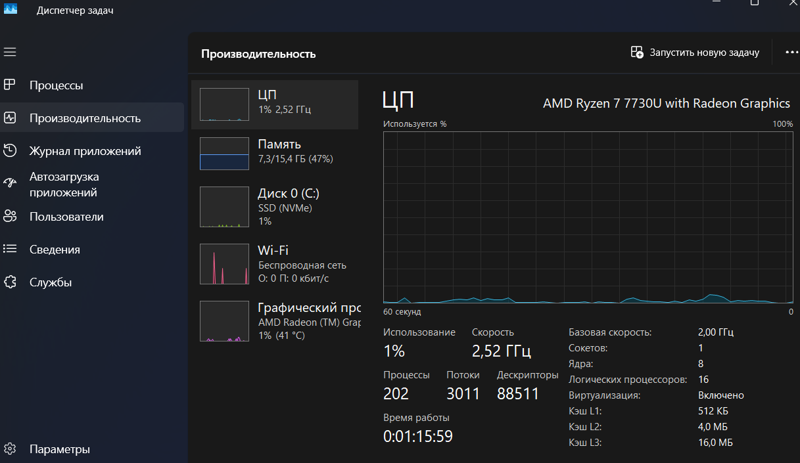
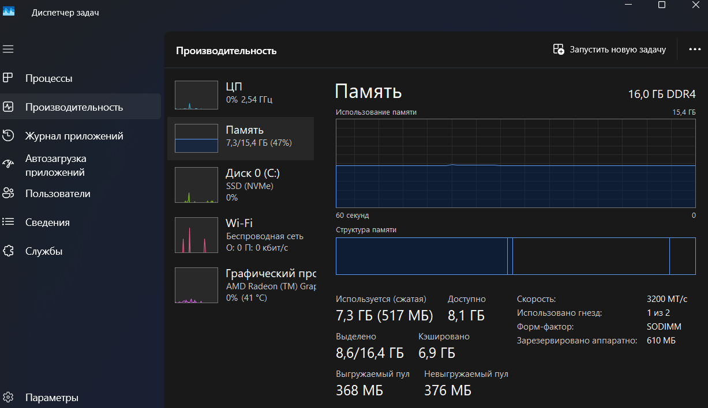
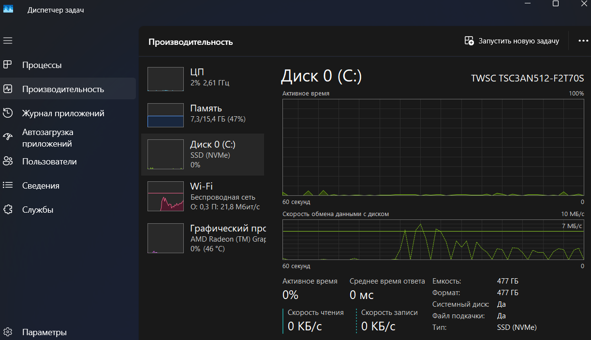
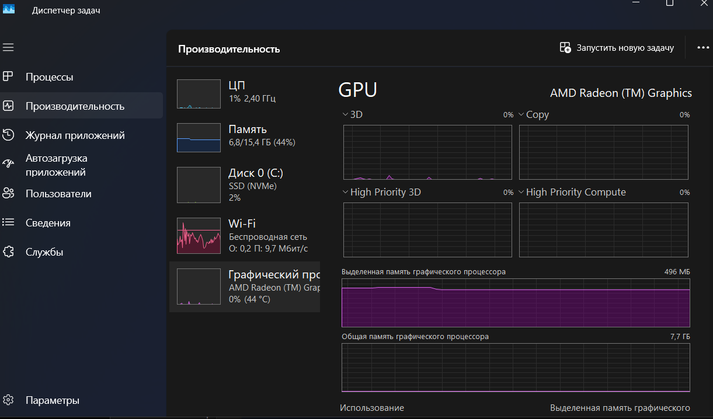
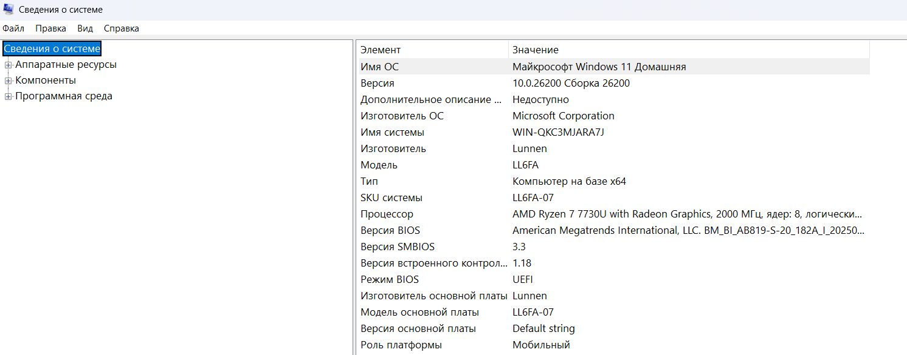

# Паспорт системы

**Дата диагностики:** 03.09.2026

**Использованные инструменты:**
- `winver` — окно с редакцией и номером сборки Windows
- Параметры Windows → Система → О системе
- Диспетчер задач → вкладка «Производительность» (ЦП, Память, Диск, GPU)
- Диспетчер задач → вкладка «Процессы»
- `msinfo32` (Сведения о системе)

---

## 1. Характеристики компьютера

| Категория | Параметр | Значение |
|---|---|---|
| Операционная система | Имя ОС | Microsoft Windows 11 Домашняя |
| Операционная система | Версия | 10.0.26200, Сборка 26200 |
| Операционная система | Изготовитель ОС | Microsoft Corporation |
| Устройство | Изготовитель | Lunnen |
| Устройство | Модель | LL6FA |
| Устройство | Тип | Компьютер на базе x64 |
| Устройство | Роль платформы | Мобильный (ноутбук), диагональ экрана 16" |
| Процессор (CPU) | Модель | AMD Ryzen 7 7730U with Radeon Graphics |
| Процессор (CPU) | Частота | 2000 МГц (базовая) |
| Процессор (CPU) | Ядра / логические процессоры | 8 ядер / 16 потоков |
| Оперативная память (RAM) | Установлено | 16,0 ГБ |
| BIOS / UEFI | Режим BIOS | UEFI |
| BIOS / UEFI | Версия BIOS | American Megatrends International, LLC. BM_BI_AB819-S-20_182A_I_20250609 (09.06.2025) |
| Система | Устройство загрузки | \Device\HarddiskVolume1 |

---

## 2. Скриншоты диагностики

### 2.1 Окно `winver` — редакция и сборка Windows

*Редакция Windows 11 Домашняя, номер сборки 26200.*

### 2.2 Параметры → Система → О системе

*Процессор AMD Ryzen 7 7730U, 16 ГБ ОЗУ, тип системы x64. Имя устройства скрыто.*

### 2.3 Диспетчер задач → Производительность → ЦП

*Модель CPU, число ядер и логических процессоров, состояние виртуализации, текущая загрузка.*

### 2.4 Диспетчер задач → Производительность → Память

*Общий объём ОЗУ (16 ГБ) и текущее использование.*

### 2.5 Диспетчер задач → Производительность → Диск

*Модель/тип диска (если указан), ёмкость и текущая активность.*

### 2.6 Диспетчер задач → Производительность → GPU

*Модель встроенной видеосистемы (AMD Radeon Graphics) и текущая загрузка.*

### 2.7 Диспетчер задач → Процессы

*Список процессов (минимум 3), столбцы CPU и Память — подтверждение многозадачности системы.*

### 2.8 Сведения о системе (msinfo32) — при необходимости

*ОС/версия, тип системы, процессор и RAM. Чувствительные строки скрыты.*

---

## 3. Вывод: пригодность ПК для программирования, виртуальных машин и Linux-сред

**Итог: ПК хорошо подходит для программирования, работы с виртуальными машинами и Linux-окружениями.**

- **CPU.** AMD Ryzen 7 7730U — современный мобильный процессор с 8 ядрами и 16 потоками. Такого количества ядер достаточно для комфортной компиляции кода, параллельной сборки проектов и одновременной работы IDE, браузера и нескольких контейнеров/виртуальных машин без заметных просадок.
- **RAM.** 16 ГБ оперативной памяти — комфортный минимум для современной разработки: хватает на IDE (VS Code, IntelliJ и т.п.), браузер с десятками вкладок и одну виртуальную машину среднего размера (2–4 ГБ) одновременно. Для нескольких тяжёлых ВМ параллельно объём уже ограничивающий, но для учебных и большинства прикладных задач достаточен.
- **Диск.** Тип и скорость диска зафиксированы на скриншоте 05_disk.png; при наличии SSD (что типично для устройств этого класса) обеспечивается быстрая загрузка ОС, IDE и виртуальных машин, а также приемлемая скорость дисковых операций внутри контейнеров.
- **Виртуализация.** Режим BIOS — UEFI, включён Secure Boot; для работы виртуальных машин (Hyper-V, VirtualBox, VMware) и таких сред, как WSL2 и Docker, требуется дополнительно включённая в BIOS поддержка аппаратной виртуализации (AMD-V/SVM) — её состояние отражено на скриншоте 03_cpu.png (пункт «Виртуализация»). При включённой аппаратной виртуализации Ryzen 7 7730U полностью поддерживает эти технологии.

Таким образом, по совокупности характеристик — многоядерный современный процессор, достаточный объём ОЗУ, UEFI с поддержкой Secure Boot и аппаратной виртуализации — ноутбук пригоден как для разработки программного обеспечения, так и для запуска виртуальных машин и Linux-дистрибутивов (нативно, через WSL2 или в виртуальной машине).
